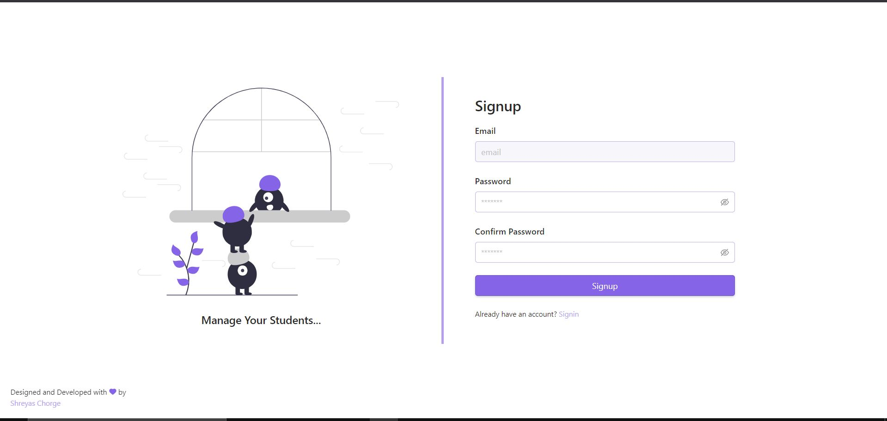
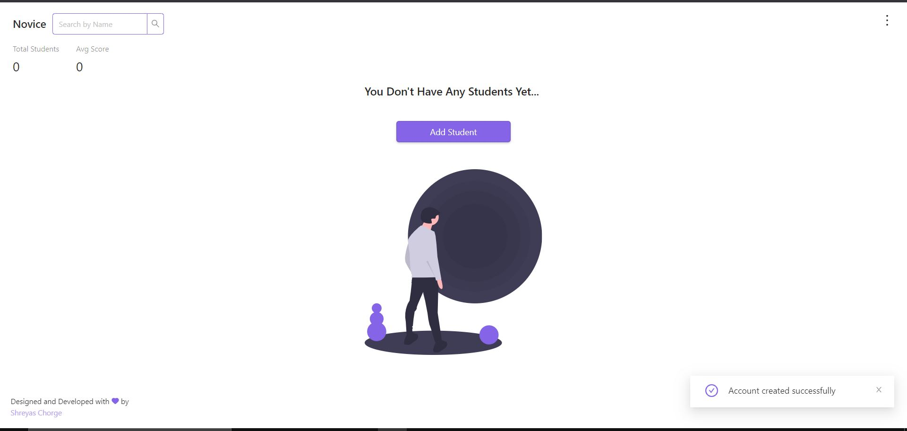
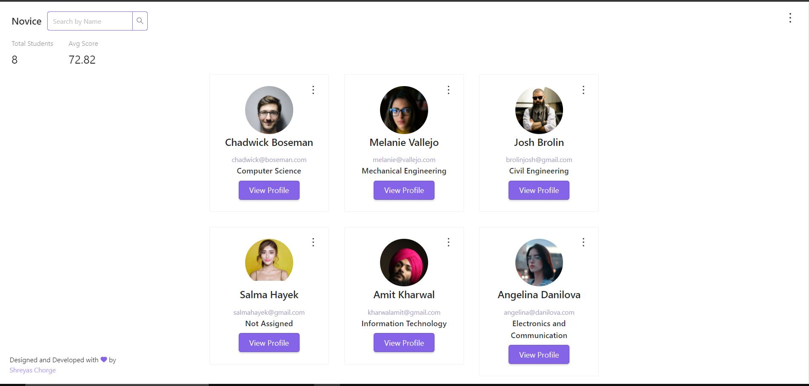
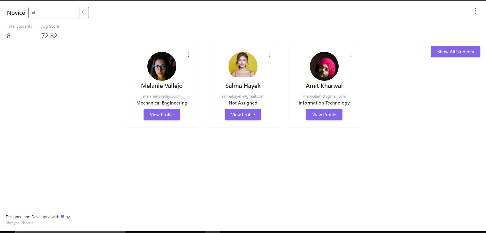
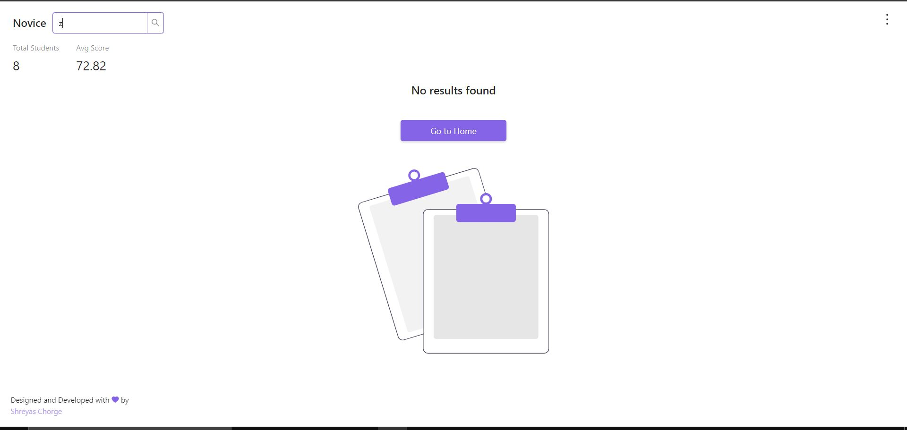
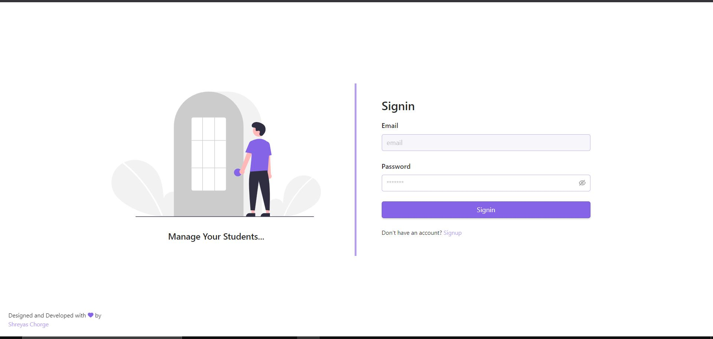

## Novice

Novice is a simple application which shares one-to-one relationship between students and its mentor, used by a mentor to manage their students.

Prerequisite to run the project

1. Docker and docker-compose must be installed

Steps to initialize the project

##### git clone https://github.com/Shreyaschorge/Novice.git

##### cd Novice

##### docker-compose up --build

## UI

